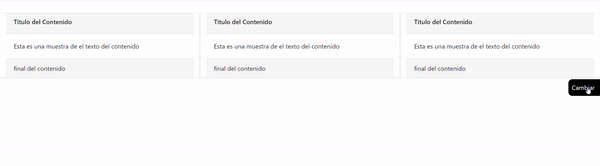

<h1>Cambio de estilos en documento</h1>

Con este código se obtiene una herramienta que sirve para cambiar los estilos de las partes del documento sin recargar la página

Para este efecto usamos CSS y JavaScript

